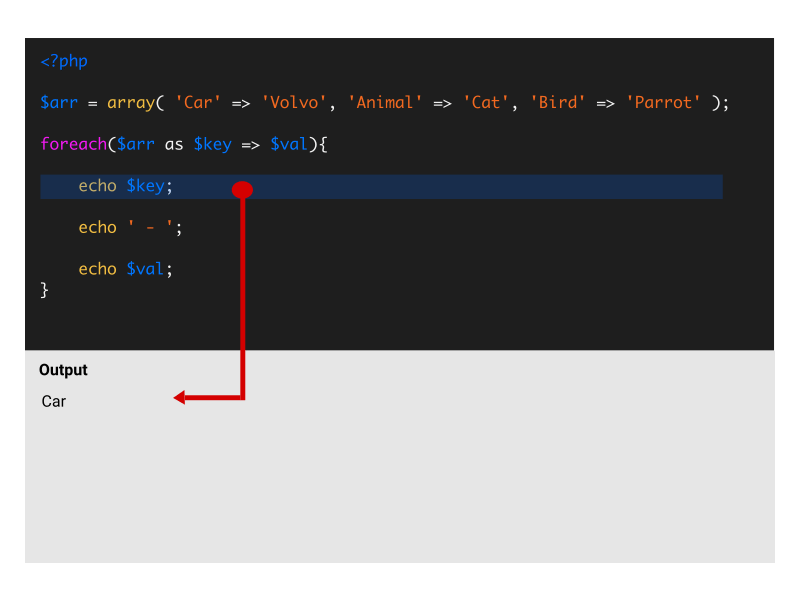

## Loops
{: .text-green-100 .fs-6 }

Een **loop** in programmeren is een constructie waarmee je een stuk code meerdere keren kunt herhalen, zolang aan een bepaalde voorwaarde wordt voldaan.  
Dit is handig als je een taak herhaaldelijk moet uitvoeren zonder dezelfde code steeds opnieuw te schrijven.



### 1- While loop
Meerdere regels met een while construct.
```php
while (condition){
    statement1;
    statement2;
}
```

Enkele regel do while construct.
```php
do statement1;
    while (condition);
```

### 2- Do While loop
Meerdere regels met do while construct.
```php
do {
    statement1;
    statement2;
} while (condition)
```

### 3- For loop
Enkele regel met een for loop construct.
```php
for (start_expr; condition; loop_expression)
    statement1;
```

Meerdere regels met een loop construct.
```php
for (start_expr; condition; loop_expression)
{
    statement1;
    statement2;
}
```

### 4- Foreach loop
Loop door een array of object en plaats de key van de regel in de variabele **'$key'** en de inhoud in de regel **'$item'**.
```php
foreach ( $array as $key => $item ) {
    statement1;
    statement2;
}
```

Loop door een array of object en plaats de inhoud in de regel **'$item'**.  De key wordt niet gebruikt.
```php
foreach ( $array as $item ) {
    statement1;
    statement2;
}
```

### 5- Onderbreking of beëindiging van script
`continue;` Sla deze keer de loop-lus over. Het script dat in de loop staat wordt deze keer niet uitgevoerd en de loop begint aan de volgende ronde.  
`break;` Stopt op het moment met de binnenste loop.  
`exit("string");` Beëindig alle scripts en laat een bericht zien.  
`die("string");` Beëindig alles en laat een bericht zien.  


---
### 6- Plaats een loop in je code
Bekijk nu bijvoorbeeld jouw index pagina, kom je een plek tegen waar je bepaalde elementen meerdere keren gebruikt?  
Bijvoorbeeld het overzicht van de singles.  
Voor nu is het niet erg als je meerdere keren hetzelfde item op je overzicht pagina hebt staan. Volgende week maken wij dit dynamisch.  


---


---


