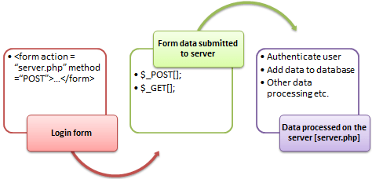

## Zoeken
{: .text-green-100 .fs-6 }

Om te kunnen zoeken moet je eerst een `zoekformulier` maken, deze verstuur je naar een `resultaat pagina`, waar je vervolgens het `resultaat` weer geeft.  


---
### 1- Zoek formulier
In de `header.php` of `navigation.php` heb je waarschijnlijk al een klein formulier zitten.  
Deze kunnen wij gaan gebruiken voor het zoeken, hiervoor moet je het formulier een `action` en een `method` geven.  
De `action` is de pagina waar wij straks naartoe verwijzen, in dit geval `search.php`  
De `method` is de manier waarop wij informatie gaan versturen, in ins geval gebruiken wij de GET methode.  
Je formulier zal er waarschijnlijk ongeveer zo uitzien: 
```html
<form class="d-flex" role="search" action="/search.php" method="get">
    <input class="form-control me-2" type="search" placeholder="Search" aria-label="Search" name="searchquery">
    <button class="btn btn-outline-success" type="submit">Search</button>
</form>
```

---
### 2- Resultaat pagina
Maak nu een php pagina ana waar je het resultaat gaat weergeven.  
Plaats ook dit bestand in de `public folder` en noem het `search.php`  
De inhoud van dit bestand kan hetzelfde zijn als `single.php` uit de views folder.

---
### 3- Zoek query
Geef nu eerst in de body van deze nieuwe pagina de zoek query weer.  
Hiervoor gebruik je de GET methode, waarbij de key `zoekterm` overeen moet komen met `naam` van het `input field` :  
```php
$zoekterm = $_GET['zoekterm'];

echo 'Je zocht op: ' . $zoekterm;
```

---
### 4- Resultaat zichtbaar op de pagina
Op dit moment weet je waar iemand naar zoekt.  
Nu is het tijd om de `query` aan te passen zodat je kunt zoeken naar een onderdeel van de `titel` van een `single`.  
Bij de query geef je nu aan dat de `WHERE singles.title = ?` niet een `gelijk aan` **operator** nodig heeft, maar een `wildcard`.  
Binnen MySQL kun je dit doen door gebruik te maken van een LIKE operator.  
Je query zal er dan zo uit zien:  
```mysql
SELECT singles.*, artists.title as artist_title, genres.title as genre_title
FROM singles
LEFT JOIN artists ON singles.artist_id = artists.id
LEFT JOIN genres ON singles.genre_id = genres.id
WHERE singles.title LIKE ?
```
Vervolgens moet je de zoekterm aanpassen waarbij je aangeeft welk onderdeel er variabel is.  
Dat doe je door een `%` te plaatsen bij de parameter waar je variabele zit.  
Ik maak daarvoor een tussen variabele als volgt:
```php
$parameter = '%' . $zoekterm . '%';
```
Alles bij elkaar zal mijn pagina er zo uit zien:
```php
<?php
define('PAGE_TITLE', 'De zoek pagina');
define('PAGE_ACTIVE', 'search');

// verbind met de database
require_once('../source/database.php');

// haal de zoekterm op wanneer deze ingesteld is,
// als dat niet het geval is wil ik dat de search query leeg is
$zoekterm = '';
if (isset($_GET['searchquery'])) {
    $zoekterm = $_GET['searchquery'];
}

include('../views/head.php');
?>
    <main class="container my-5">
        <h2>Je zocht op: `<?= $zoekterm ?>`</h2>
        <div class="row">
            <?php

            /* create a query */
            $query = 'SELECT singles.*, artists.title as artist_title, genres.title as genre_title
                FROM singles
                LEFT JOIN artists ON singles.artist_id = artists.id
                LEFT JOIN genres ON singles.genre_id = genres.id
                WHERE singles.title LIKE ?';

            /* create a prepared statement */
            $stmt = $connection->prepare($query);

            /* Bind the search term with a variable start and end */
            $parameter = '%' . $zoekterm . '%';
            $stmt->bind_param('s', $parameter);

            /* execute query */
            $stmt->execute();

            /* bind result variables */
            $result = $stmt->get_result();

            /* define an array with the result as long as there is a result */
            while ($single = mysqli_fetch_assoc($result)) {
                include('../views/card.php');
            }
            ?>
        </div>
    </main>

<?php
include('../views/footer.php');
```

---
### 5- Resultaat in zoek formulier
Als ik gezocht heb dan is het zoekformulier nu leeg.  
Kun jij met alle kennis die je nu hebt ( en online kunt vinden ) hoe je in het zoekformulier in het input veld de oude waarde kunt weergeven?  


---




---
### Volgende stap:
{: .text-green-100 .fs-4 }  
In de volgende pagina vindt je een extra uitdaging, deze helpt je seo beter te begrijpen.
[Extra seo links](extraseo)


